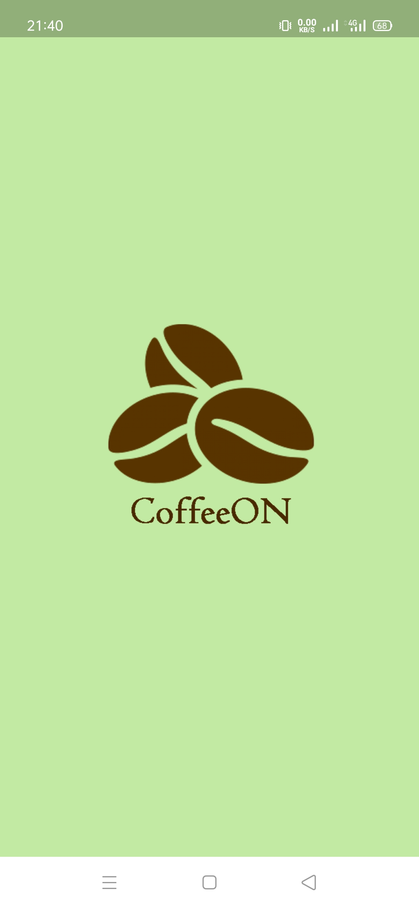
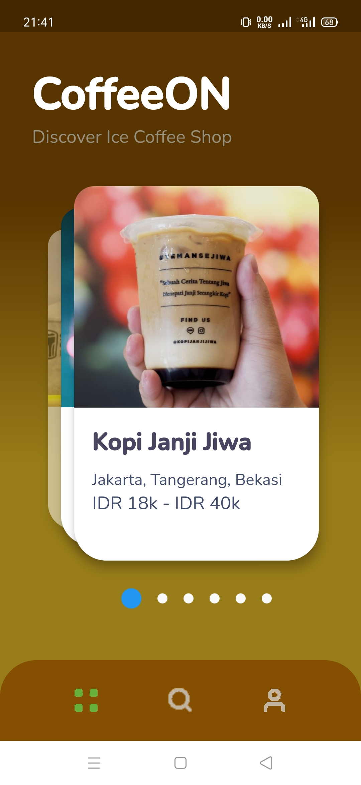
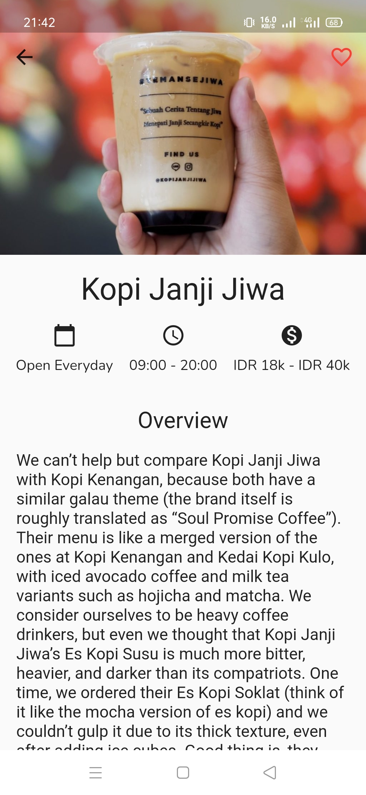
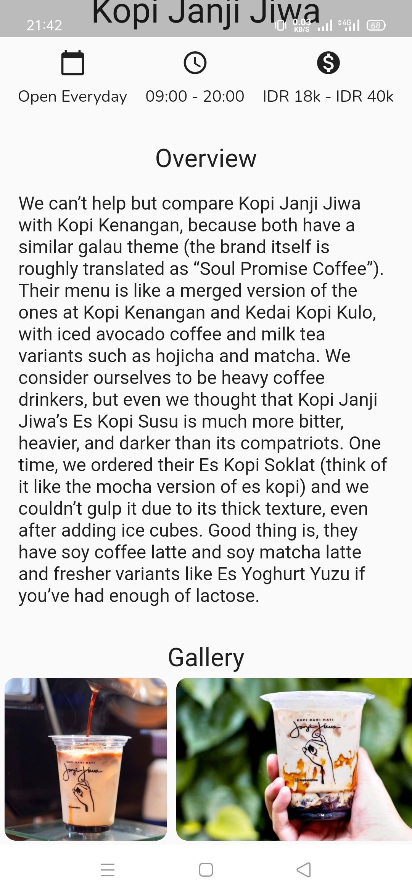

<p align="center">
  <a href="https://github.com/nicktra/coffeeon">
    
  </a>
</p>

<h3 align="center">CoffeeON</h3>

<p align="center">
    CoffeeON is An App for Discover Ice Coffee Shop Chains in near you.
    <br />
    <a href="https://github.com/nicktra/coffeeon"><strong>Explore the docs »</strong></a>
</p>

# CoffeeON

CoffeeON is An App for Discover Ice Coffee Shop Chains in near you.

## Getting Started

These instructions will get you a copy of the project up and running on your local machine for development and testing purposes.

### Prerequisites

Things you need to install the software and how to install them

* Flutter SDK
* IDE (Android Studio/ VS Code/ Intellij IDEA)

### Installing

1. Clone the repo
```sh
git clone https://github.com/nicktra/coffeeon.git
```
2. Open with your IDE

## Features

* List Ice Coffee Shop
* Detail Ice Coffee Shop

## Screenshots App
<pre>
            
</pre>

## Built With

* [Dart](https://dart.dev/) - The Programming Language
* [Flutter](https://flutter.dev/) -  Google’s UI toolkit for building beautiful, natively compiled applications for mobile, web, and desktop from a single codebase.
* [Animated Splash Screen](https://pub.dev/packages/animated_splash_screen) The easiest way to create your animated splash screen in a fully customizable way.
* [Flutter Swiper](https://pub.dev/packages/flutter_swiper) The best swiper(carousel) for flutter, with multiple layouts, infinite loop. Compatible with Android & iOS.
* [Auto Size Text](https://pub.dev/packages/auto_size_text) Flutter widget that automatically resizes text to fit perfectly within its bounds.
* [Toast](https://pub.dev/packages/toast) A Flutter Toast plugin.
* [Flutter Launcher Icons](https://pub.dev/packages/flutter_launcher_icons) A package which simplifies the task of updating your Flutter app's launcher icon.

## Contributing

Contributions are what make the open source community such an amazing place to be learn, inspire, and create. Any contributions you make are **greatly appreciated**.

1. Fork the Project
2. Create your Feature Branch (`git checkout -b feature/AmazingFeature`)
3. Commit your Changes (`git commit -m 'Add some AmazingFeature'`)
4. Push to the Branch (`git push origin feature/AmazingFeature`)
5. Open a Pull Request

## Contact

* **Konik Saputra** - [@koniksaputra](https://twitter.com/koniksaputra) - koniksaputra@live.com

## License

This project is licensed under the MIT License. See `LICENSE` for more information